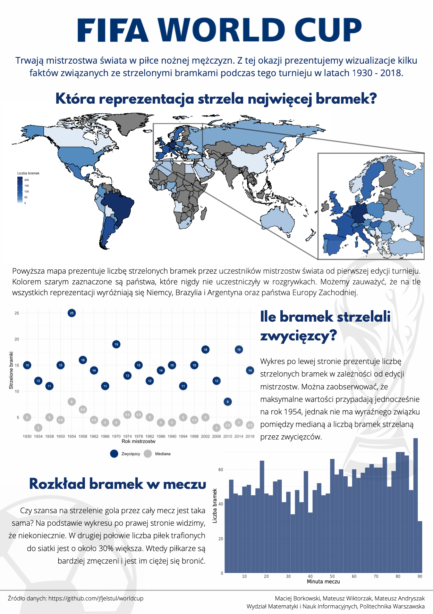

# FIFA World Cup poster
Project created for *Data Visualization Techniques* classes, Data Science studies in the winter semester 2022/23 📈🏅

## About project
The topic of the project task was to find and process data and prepare a poster about the sport of our choice. 
We decided on football because of the World Cup 2022, which was taking place at the time the poster was created. 

To create charts, we used the `R` language, packages such as `dplyr`, `ggplot2`, other visualization tools and Canva to merge the created graphs.

The first chart shows the number of goals scored by country using a world map, the second presents the median of goals scored according to the edition of the championship and the number of goals scored by the winners and 
the third presents the distribution of goals per match.

The data are from all editions of the championship until 2018.
Sources ~ https://github.com/jfjelstul/worldcup.

## Poster

             

## Authors
Data Science students at Warsaw University of Technology:
* [Maciej Borkowski](https://github.com/BorkowskiMaciej) - the second chart and post-production in Canva
* [Mateusz Andryszak](https://github.com/17Andri17) - the first chart
* [Mateusz Wiktorzak](https://github.com/wiktorzakmateusz) - the third chart

